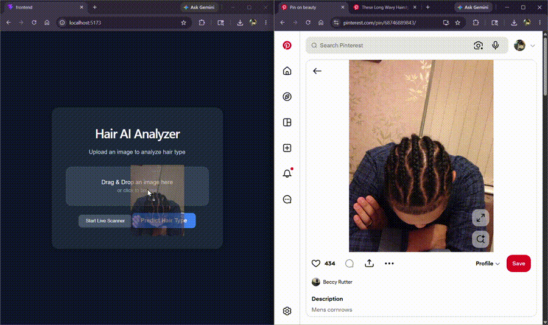

# Hair AI Analyzer

A machine learning web application that predicts hair textures and hairstyles using computer vision and deep learning.

Built with React, FastAPI, and PyTorch using a custom-trained MobileNetV2 model.

---

## Demo


---

## Features

- Image upload predictions
- Live webcam scanning
- Real-time confidence scores
- Custom-trained deep learning model
- Multiple hairstyle categories

---

## Hair Categories

- Braids
- Coily
- Curly
- Locs
- Straight
- Wavy

---

## Tech Stack

### Frontend
- React
- JavaScript
- React Webcam
- React Dropzone

### Backend
- FastAPI
- Python
- PyTorch
- Torchvision

---

## Installation

Install frontend dependencies:

```bash
cd frontend
npm install
```

---

## Running the Project

### Start Backend

```bash
cd src
uvicorn api:app --reload
```

### Start Frontend

Open a new terminal:

```bash
cd frontend
npm run dev
```

---

## Training the Model

```bash
cd src
python train.py
